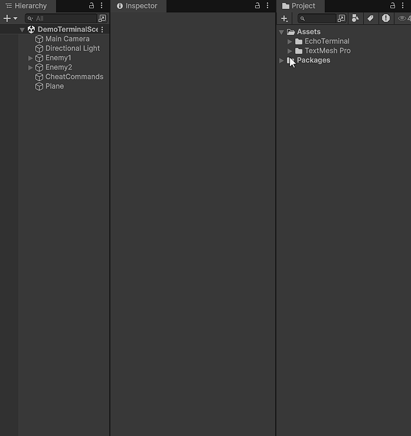
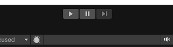
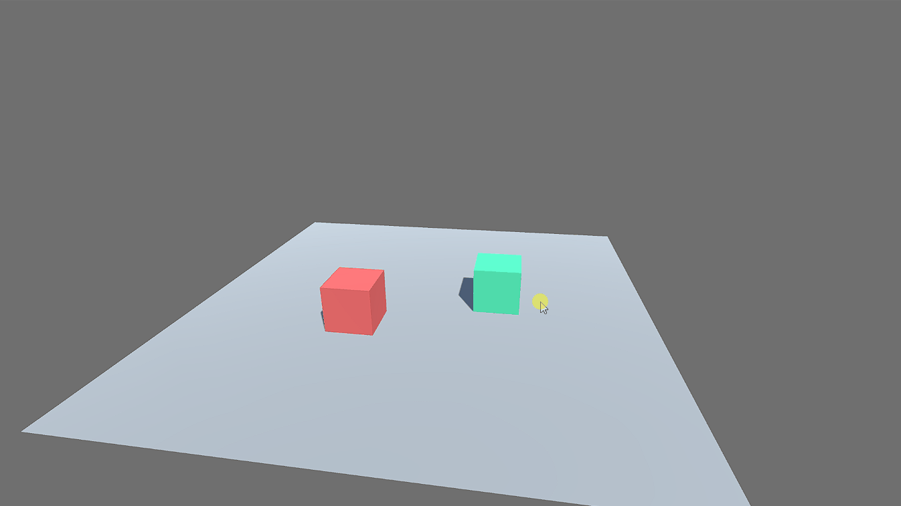
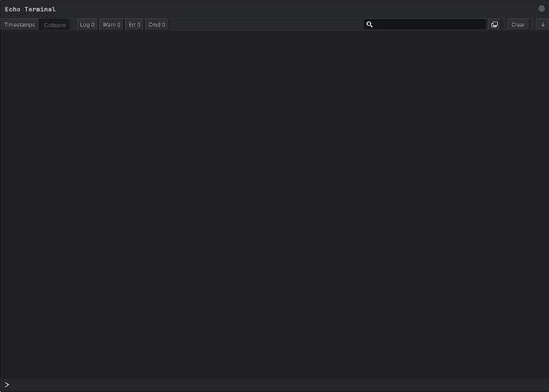

# Getting Started

## Requirements

- Unity 6 (6000.x)
- UI Toolkit (included in Unity 6)
- TextMeshPro


Echo Terminal may work on earlier Unity versions but has only been tested on Unity 6. If you hit issues on a specific version, [open a ticket](https://github.com/Dolpix/EchoTerminal/issues).


---

## Installation

Download the Unity package and install it, **or** copy the `Assets/EchoTerminal` folder from the repo into your project.


You don't need the `Assets/EchoTerminal/Demo` or `Assets/EchoTerminal/Editor/Tests` folders.


---

## Add the terminal to a scene

**1. Add the `EchoTerminal` prefab into your scene.**



**2. Press Play.**



**3. Press `~` to open the terminal.**



**4. Type `help` to see all registered commands.**



For editor tooling, use `EditorTerminalUI` inside an `EditorWindow` instead.

---

## Your first command

```csharp
public class PlayerCommands : MonoBehaviour
{
    [TerminalCommand("heal")]
    void Heal(float amount)
    {
        GetComponent<Health>().Add(amount);
    }
}
```

`Terminal` scans all assemblies at startup. Type `heal 50` in the console and this method fires on every active instance in the scene. No registration step needed.
